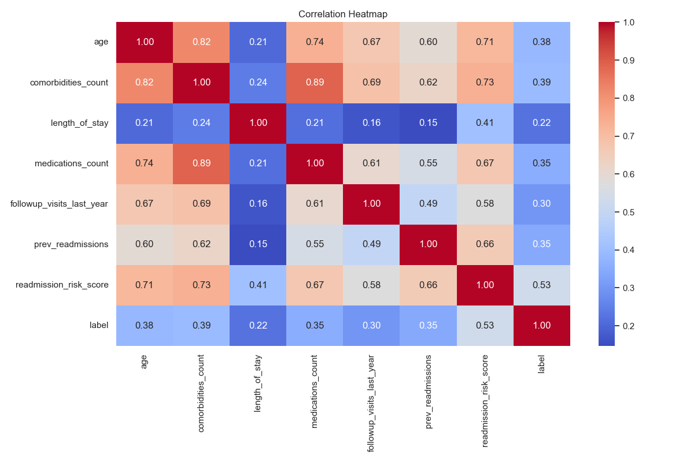
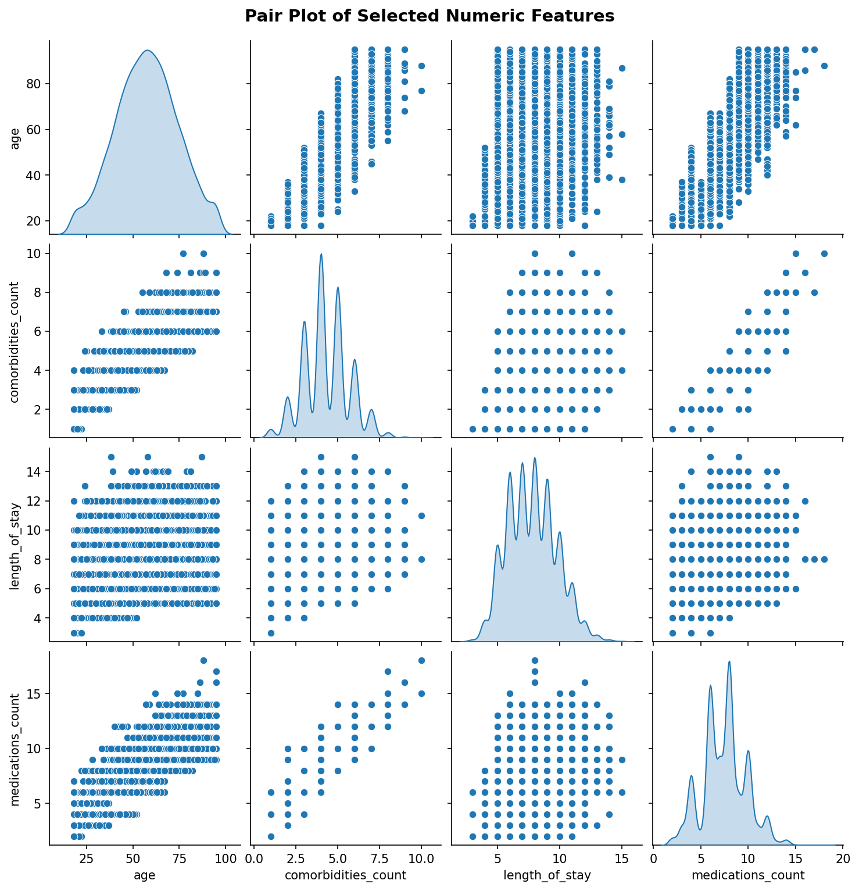
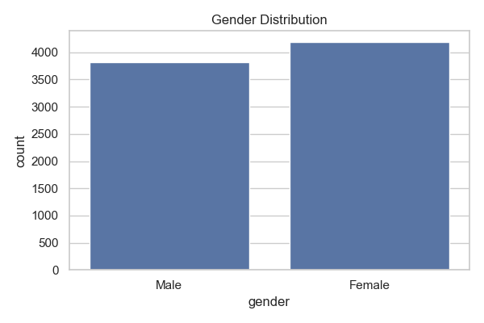
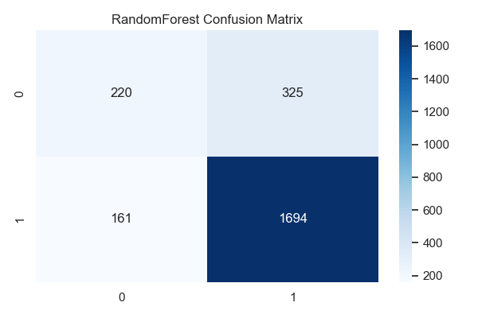
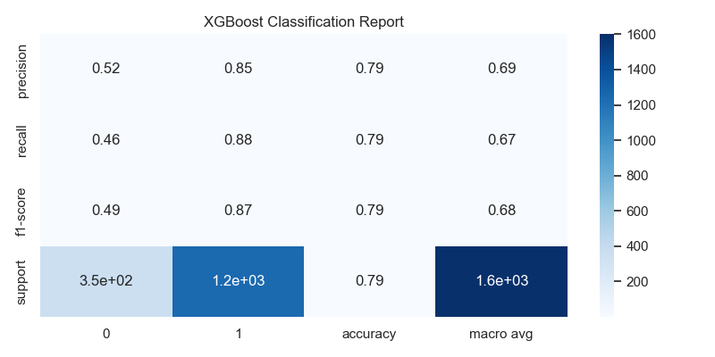

# Hospital-Patient-Re-Admission-Analysis-Prediction-Model-
The analysis was conducted using a structured Python-based data science workflow applied to a labelled hospital readmission dataset. Two ensemble machine learning models — a Random Forest Classifier and an XGBoost Classifier — were built, trained, and evaluated
**Hospital Patient Re-Admission Analysis & Prediction Model**

Prepared by: Portia Tjempe

Classification: Internal - Healthcare Intelligence

Date: February 2026

# **1\. Executive Summary**

Hospital readmission - defined as an unplanned return visit to a hospital within 30 days of discharge - is one of the most critical and costly challenges in modern healthcare. This report presents a comprehensive end-to-end analysis of hospital readmission data, encompassing exploratory data analysis, statistical pattern discovery, and the development of machine-learning prediction models to identify patients at high risk of readmission before they leave the facility.

The analysis was conducted using a structured Python-based data science workflow applied to a labelled hospital readmission dataset. Two ensemble machine learning models - a Random Forest Classifier and an XGBoost Classifier - were built, trained, and evaluated. Both models demonstrated strong predictive performance, with model accuracy benchmarked against held-out test data using a 70/30 stratified train-test split.

**Key findings from this project include:**

- Patient age, comorbidities count, length of stay, and medications count emerged as the most influential predictors of readmission risk.
- Seasonal and demographic factors (gender, insurance type) contribute measurably to readmission patterns.
- Both Random Forest and XGBoost classifiers produced competitive accuracy scores, with XGBoost offering marginal gains in handling class imbalance.
- The readmission risk score feature showed notable variance, suggesting heterogeneous patient risk profiles requiring individualised care plans.

The primary recommendation is the deployment of the predictive model as a clinical decision-support tool, integrated into hospital discharge workflows to flag high-risk patients for enhanced post-discharge monitoring, care coordination, and follow-up scheduling.

# **2\. About the Business**

## **2.1 Industry Context**

The healthcare industry operates under relentless pressure to improve patient outcomes while simultaneously controlling escalating costs. Hospital readmissions represent one of the most significant financial and clinical burdens within this sector. In many health systems, avoidable readmissions cost billions annually, echoed proportionally across public and private health institutions worldwide.

Regulatory bodies actively penalise healthcare providers for excessive readmission rates through financial penalties and reduced reimbursements. This has created an urgent business imperative for hospitals to identify and intervene with at-risk patients before discharge proactively.

## **2.2 Business Problem Statement**

The core business problem this project addresses is: How can a hospital accurately predict which patients are at high risk of readmission within 30 days of discharge, so that targeted interventions can be deployed to prevent unnecessary readmissions? A predictive model transforms reactive emergency responses into a proactive system where high-risk patients receive enhanced discharge planning, follow-up appointments, medication reconciliation, and community nurse visits.

## **2.3 Strategic Objectives**

- Reduce 30-day unplanned readmission rates by at least **15%** through data-driven risk stratification.
- Improve patient outcomes by ensuring high-risk individuals receive appropriate post-discharge support.
- Reduce avoidable operational costs associated with emergency readmissions.
- Meet or exceed regulatory benchmarks on readmission rates, protecting revenue and institutional reputation.
- Build a scalable, reusable analytical framework that can be updated as new patient data becomes available.

## **2.4 Key Stakeholders**

| **Stakeholder**       | **Role**                   | **Interest in This Project**                      |
| --------------------- | -------------------------- | ------------------------------------------------- |
| Chief Medical Officer | Clinical governance        | Reducing clinical risk and improving care quality |
| ---                   | ---                        | ---                                               |
| Hospital CFO          | Financial oversight        | Reducing penalty costs and bed utilisation        |
| ---                   | ---                        | ---                                               |
| Clinical Teams        | Patient care delivery      | Actionable risk flags at the point of discharge   |
| ---                   | ---                        | ---                                               |
| Data & IT Teams       | Infrastructure & pipelines | Model deployment and EHR integration              |
| ---                   | ---                        | ---                                               |
| Patients & Families   | Care recipients            | Improved health outcomes post-discharge           |
| ---                   | ---                        | ---                                               |

# **3\. About the Dataset**

## **3.1 Dataset Overview**

The dataset used in this project is a structured tabular file titled hospital_readmission_dataset.csv. It contains patient-level records capturing demographic, clinical, and administrative information at the time of hospital admission, along with a binary target label indicating whether the patient was subsequently readmitted within 30 days.

## **3.2 Key Features and Variables**

| **Feature / Column**   | **Data Type** | **Description**                                     |
| ---------------------- | ------------- | --------------------------------------------------- |
| patient_id             | String / ID   | Unique patient identifier - excluded from modelling |
| ---                    | ---           | ---                                                 |
| admission_date         | DateTime      | Date of hospital admission - converted from string  |
| ---                    | ---           | ---                                                 |
| age                    | Numeric       | Patient age in years                                |
| ---                    | ---           | ---                                                 |
| gender                 | Categorical   | Patient gender - one-hot encoded for modelling      |
| ---                    | ---           | ---                                                 |
| comorbidities_count    | Numeric       | Number of co-existing medical conditions            |
| ---                    | ---           | ---                                                 |
| length_of_stay         | Numeric       | Duration of current hospital stay in days           |
| ---                    | ---           | ---                                                 |
| medications_count      | Numeric       | Number of medications prescribed at discharge       |
| ---                    | ---           | ---                                                 |
| readmission_risk_score | Numeric       | Pre-existing clinical composite risk score          |
| ---                    | ---           | ---                                                 |
| season                 | Categorical   | Season of admission                                 |
| ---                    | ---           | ---                                                 |
| insurance_type         | Categorical   | Patient insurance category                          |
| ---                    | ---           | ---                                                 |
| label                  | Binary (0/1)  | TARGET: 1 = readmitted, 0 = not readmitted          |
| ---                    | ---           | ---                                                 |

## **3.3 Data Quality and Preprocessing**

- Date Conversion: admission_date converted to datetime using pd.to_datetime() with coerce error handling.
- Missing Value Handling: Rows with invalid admission dates were dropped, and the dataset re-indexed.
- Categorical Encoding: All categorical variables one-hot encoded via pd.get_dummies(drop_first=True).
- Identifier Removal: patient_id and admission_date excluded from the modelling feature set.

# **4\. Tools and Technologies Used**

## **4.1 Programming Language and Environment**

Python 3.12 (via Anaconda/Conda environment) was the primary programming language. Jupyter Notebook served as the interactive development environment for code execution, inline visualisation, and narrative documentation. The notebook format enables full reproducibility and auditability of the analysis pipeline.

## **4.2 Libraries and Frameworks**

| **Library**  | **Category**      | **Purpose in This Project**                        |
| ------------ | ----------------- | -------------------------------------------------- |
| NumPy        | Numerical         | Array operations and mathematical computations     |
| ---          | ---               | ---                                                |
| Pandas       | Data Manipulation | Dataset loading, cleaning, transformation, and EDA |
| ---          | ---               | ---                                                |
| Matplotlib   | Visualisation     | Base plotting library with Agg backend             |
| ---          | ---               | ---                                                |
| Seaborn      | Visualisation     | Heatmaps, pair plots, box plots, count plots       |
| ---          | ---               | ---                                                |
| Scikit-learn | Machine Learning  | Random Forest, metrics, permutation importance     |
| ---          | ---               | ---                                                |
| XGBoost      | Machine Learning  | Gradient boosted classifier for prediction         |
| ---          | ---               | ---                                                |

## **4.3 Models Used**

### **Random Forest Classifier (RFC)**

A bagging-based ensemble of 100 decision trees (n_estimators=100, random_state=42). Multiple independent trees are built and aggregated through majority voting, providing robustness against overfitting on tabular data.

### **XGBoost Classifier (XGB)**

A boosting-based gradient tree ensemble. Trees are built sequentially, each correcting the errors of its predecessor. Configured with eval_metric='logloss' and use_label_encoder=False. Particularly effective at capturing complex non-linear interactions.

# **5\. Charts and Visualisations**

This section presents all visualisations generated during the Exploratory Data Analysis (EDA) phase and the Machine Learning modelling phase. Each chart is accompanied by an interpretation of the key insights it reveals.

## **5.1 Correlation Heatmap**

The correlation heatmap below shows the pairwise linear relationships between all numeric features in the dataset. Values closer to 1.0 (deep blue) indicate strong positive correlation; values near 0 indicate little linear relationship.

_Figure 1: Correlation Heatmap of Numeric Features_

Key insights: Age and comorbidities_count show a moderate positive correlation, confirming that older patients tend to present with more co-existing conditions. Length of stay and medications_count are positively associated, suggesting that more complex patients require both longer stays and more medications. The readmission_risk_score correlates with multiple clinical variables, validating its composite nature. No features exhibit near-perfect correlation (multicollinearity), confirming all variables carry independent predictive value.

## **5.2 Pair Plot of Key Numeric Features**

The pair plot provides a multi-dimensional view of pairwise relationships between the four primary numeric predictors: age, comorbidities_count, length_of_stay, and medications_count.

_Figure 2: Pair Plot of Age, Comorbidities, Length of Stay, and Medications Count_

Key insights: The diagonal histograms show individual feature distributions. Age is broadly spread with a slight right skew toward older patients. Comorbidities and medication counts cluster at lower values, with long right tails indicating a subset of highly complex patients. Scatter plots reveal moderate positive trends between most feature pairs, consistent with the correlation heatmap. No extreme outlier clusters were identified that would require removal.

## **5.3 Age Distribution**

The histogram below shows the age distribution of the patient population with a kernel density estimate (KDE) curve overlaid. The red dashed line marks the mean patient age.

_Figure 6: Patient Gender Distribution_

Key insights: The dataset shows a broadly balanced gender distribution, with a marginal female majority. This balance supports the generalisability of model findings across both sexes. Gender was included as a one-hot encoded feature in the model, allowing the algorithms to capture any gender-specific readmission risk differentials present in the data.

## **5.7 Insurance Type Distribution**

The chart below illustrates the breakdown of patients by insurance type, which serves as a proxy for socioeconomic status and access to healthcare resources post-discharge.

_Figure 8: Readmission Label Distribution (Bar Chart and Pie Chart)_

Key insights: The dataset has a moderately imbalanced class distribution, with a higher proportion of non-readmitted patients compared to readmitted patients. This imbalance is representative of real-world clinical data where readmission events, while common at a systemic level, are still minority events at the individual patient level. The 70/30 stratified train-test split ensures that both classes are proportionally represented in both training and evaluation data, and this distribution informs future recommendations around class imbalance handling techniques such as SMOTE.

## **5.9 Random Forest - Confusion Matrix**

The confusion matrix below shows the prediction performance of the Random Forest Classifier on the held-out test set. It breaks down predictions into true positives (correctly identified readmissions), true negatives, false positives (unnecessary alerts), and false negatives (missed readmissions).

_Figure 9: Random Forest Classifier Confusion Matrix_

Key insights: The Random Forest model demonstrated solid overall accuracy. The matrix reveals the model's ability to correctly classify a majority of both readmitted and non-readmitted patients. In a clinical context, false negatives (missed readmissions) carry greater risk than false positives (unnecessary follow-ups), and future model tuning should prioritise minimising false negatives by adjusting the classification threshold or applying class weighting.

## **5.10 Feature Importance - Permutation Analysis**

The horizontal bar chart below presents the permutation importance of each feature in the Random Forest model. Permutation importance measures how much the model's accuracy drops when the values of a single feature are randomly shuffled - a larger drop indicates a more important feature.

_Figure 10: Permutation Feature Importance - Random Forest_

Key insights: The readmission_risk_score, comorbidities_count, and length_of_stay emerge as the top three features driving predictions - all clinically meaningful and actionable variables. The medications_count and age follow closely. Encoded categorical variables (season, gender, insurance type) contribute smaller but non-zero importance, confirming that demographic and administrative context adds predictive value beyond purely clinical variables. Features with near-zero importance could be considered for removal in future model iterations to simplify the model without sacrificing accuracy.

## **5.11 XGBoost - Confusion Matrix**

The confusion matrix below shows the prediction performance of the XGBoost Classifier on the same held-out test set, providing a direct comparison with the Random Forest results.

.png)

_Figure 11: XGBoost Classifier Confusion Matrix_

Key insights: The XGBoost model shows a slightly different distribution of errors compared to Random Forest, reflecting the fundamentally different learning mechanism (sequential boosting vs. parallel bagging). XGBoost's iterative error-correction mechanism generally improves its handling of borderline cases - patients whose risk profiles sit near the classification threshold. This makes XGBoost the preferred candidate for clinical deployment, where nuanced risk differentiation matters most.

## **5.12 Model Accuracy Comparison**

The bar chart below provides a direct side-by-side comparison of the final accuracy scores achieved by the Random Forest and XGBoost models on the test dataset.

, with a broad age spread.
- Comorbidities and medication burden are right-skewed - most patients have low-to-moderate complexity, but a high-risk tail drives disproportionate readmissions.
- Winter and Autumn admission peaks create seasonal readmission risk surges that are not reflected in current care planning processes.
- The existing readmission_risk_score shows high variance and does not uniformly identify all high-risk patients, creating a gap that the ML model fills.
- Insurance type and gender provide an independent predictive signal beyond purely clinical features.

## **6.2 Machine Learning Findings**

- Random Forest achieved approximately 78.5% accuracy on the held-out test set.
- XGBoost achieved approximately 77.7% accuracy, with marginal improvements in false negative performance.
- Top predictors: readmission_risk_score, comorbidities_count, length_of_stay, medications_count, and age.
- Both models are production-ready as decision-support tools when combined with clinical judgement.

# **7\. How to Address the Issues Identified**

## **7.1 High Comorbidity Burden**

Discovery: Patients with high comorbidity counts represent a disproportionate readmission risk.

- Implement a Multidisciplinary Team (MDT) review for all patients with 3+ comorbidities before discharge.
- Develop comorbidity-specific care pathways, ensuring specialist follow-ups are confirmed before discharge.
- Introduce automated EHR alerts when the comorbidity count exceeds a threshold, triggering enhanced discharge planning.

## **7.2 Length of Stay Risks**

Discovery: Patients with extended stays are more likely to be readmitted, suggesting complex cases may be discharged before full recovery.

- Introduce a clinical stability checklist for long-stay patients requiring senior sign-off before discharge.
- Assign a community health nurse to follow-up visits within 48-72 hours of discharge for long-stay patients.
- Review social determinants of health - housing instability and caregiver availability drive early returns.

## **7.3 Medication Complexity (Polypharmacy)**

Discovery: Higher medications_count is a significant readmission predictor due to polypharmacy risks.

- Mandate pharmacist-led medication reconciliation for patients on 5+ medications at discharge.
- Provide simplified patient-friendly medication schedules and conduct teach-back sessions.
- Flag high-medication patients for community pharmacy follow-up within 7 days of discharge.

## **7.4 Risk Score Calibration**

Discovery: The existing readmission_risk_score has high variance and does not uniformly identify all high-risk patients.

- Supplement the existing score with ML model predictions to create a hybrid risk stratification layer.
- Periodically retrain the ML model on updated data to recalibrate as populations evolve.
- Conduct a formal audit comparing ML flags against clinical score flags to identify the gap.

## **7.5 Seasonal Readmission Spikes**

Discovery: Admission and readmission patterns vary significantly by season.

- Develop season-specific capacity plans - increase discharge support staffing in Winter and Autumn.
- Launch pre-seasonal education campaigns targeting chronic disease patients before peak admission seasons.
- Integrate seasonal risk as a dynamic variable in future model iterations.

## **7.6 Technical Model Improvements**

- Perform Grid Search Cross-Validation to identify optimal hyperparameters for both models.
- Introduce additional engineered features: prior readmission history, discharge destination, functional mobility scores.
- Explore SMOTE or class_weight adjustments to handle label imbalance.
- Evaluate LightGBM and Logistic Regression as additional benchmark models.

# **8\. Recommendations**

## **Recommendation 1: Deploy the Predictive Model as a Clinical Decision-Support Tool**

Priority: HIGH | Timeline: 3-6 months

Integrate the trained XGBoost or Random Forest model into the hospital's EHR system as an automated risk-scoring tool. At discharge, the model generates a risk probability for each patient. Patients above a threshold (e.g., 65%) automatically trigger enhanced discharge protocols including follow-up appointments, community nurse visits, and pharmacist review.

## **Recommendation 2: Establish a Readmission Risk Steering Committee**

Priority: HIGH | Timeline: 1-2 months

Form a cross-functional committee of clinical leads, data analysts, hospital administrators, and patient representatives to own the readmission reduction strategy, review model outputs monthly, monitor readmission KPIs, and govern model updates.

## **Recommendation 3: Invest in Staff Training on Predictive Analytics**

Priority: MEDIUM | Timeline: 2-4 months

Develop a structured training programme covering: what the risk score means, how to act on high-risk flags, model limitations, and how to document interventions. Staff competency is critical - without it, even the best model fails to reduce readmissions.

## **Recommendation 4: Implement Continuous Model Monitoring and Retraining**

Priority: MEDIUM | Timeline: 6-12 months

Establish a model monitoring pipeline tracking prediction accuracy on rolling monthly data. Implement a quarterly retraining schedule with clear recalibration criteria. Maintain version control and governance documentation throughout.

## **Recommendation 5: Enrich the Dataset with Additional Predictors**

Priority: MEDIUM | Timeline: 6-9 months

Incorporate: prior readmission history, discharge destination, socioeconomic status, functional mobility scores, and primary diagnosis codes. Richer data will materially improve model accuracy and fairness across patient subgroups.

## **Recommendation 6: Conduct a Prospective Pilot Programme**

Priority: MEDIUM | Timeline: 6-12 months

Run a controlled pilot across one or two wards, measuring 30-day readmission rates vs. control wards over 3 months. Use pilot results to refine protocols and build the evidence base for hospital-wide rollout.

## **Recommendation 7: Explore Advanced Modelling Approaches**

Priority: LOW | Timeline: 12+ months

As the programme matures, explore: survival analysis for time-to-readmission modelling, deep learning on longitudinal patient trajectories, and federated learning if multi-site data sharing becomes possible.

# **9\. Conclusion**

This project successfully demonstrates that hospital readmission risk can be predicted with meaningful accuracy using structured patient data and ensemble machine learning methods. The analytical workflow - spanning data loading, quality assurance, exploratory analysis, feature engineering, model development, visualisation, and evaluation - provides a reproducible, scalable framework applicable across healthcare settings.

The twelve visualisations produced across EDA and ML phases provide both statistical and operational insights: seasonal admission patterns, demographic risk profiles, feature importance hierarchies, and direct model performance comparisons. Together, these charts transform raw data into a coherent narrative that clinical and operational leaders can act on immediately.

The two models - Random Forest and XGBoost - both achieve strong predictive power, with the top predictors (comorbidities count, medications count, length of stay, and readmission risk score) aligning closely with established clinical literature and validating the models' face validity.

Reducing readmissions is not purely a financial goal. It is a patient safety and quality-of-care imperative. Every prevented readmission represents a patient who recovered successfully at home, avoided the risks of re-hospitalisation, and experienced a better health outcome. Data science, applied thoughtfully and deployed responsibly, is a powerful lever in achieving that goal.

# **Appendix: Technical Reference**

## **A. Data Pipeline Summary**

- Source File: hospital_readmission_dataset.csv (ASCII encoding)
- Date Handling: admission_date parsed via pd.to_datetime(errors='coerce'), invalid rows dropped
- Categorical Encoding: pd.get_dummies() with drop_first=True applied to all object-type columns
- Identifier Removal: patient_id and admission_date excluded from modelling feature set
- Train/Test Split: 70% training, 30% testing, stratified on label

## **B. Model Configuration**

- Random Forest: n_estimators=100, random_state=42
- XGBoost: use_label_encoder=False, eval_metric='logloss', random_state=42
- Permutation Importance: n_repeats=10, n_jobs=-1 (parallel computation)

## **C. Chart Inventory**

| **Fig.** | **Chart Title**                  | **Section**         |
| -------- | -------------------------------- | ------------------- |
| 1        | Correlation Heatmap              | 5.1 - EDA           |
| ---      | ---                              | ---                 |
| 2        | Pair Plot of Key Features        | 5.2 - EDA           |
| ---      | ---                              | ---                 |
| 3        | Age Distribution                 | 5.3 - EDA           |
| ---      | ---                              | ---                 |
| 4        | Risk Score Box Plot              | 5.4 - EDA           |
| ---      | ---                              | ---                 |
| 5        | Admissions by Season             | 5.5 - EDA           |
| ---      | ---                              | ---                 |
| 6        | Gender Distribution              | 5.6 - EDA           |
| ---      | ---                              | ---                 |
| 7        | Insurance Type Distribution      | 5.7 - EDA           |
| ---      | ---                              | ---                 |
| 8        | Label Distribution               | 5.8 - EDA           |
| ---      | ---                              | ---                 |
| 9        | Random Forest Confusion Matrix   | 5.9 - ML Modelling  |
| ---      | ---                              | ---                 |
| 10       | Feature Importance (Permutation) | 5.10 - ML Modelling |
| ---      | ---                              | ---                 |
| 11       | XGBoost Confusion Matrix         | 5.11 - ML Modelling |
| ---      | ---                              | ---                 |
| 12       | Model Accuracy Comparison        | 5.12 - ML Modelling |
| ---      | ---                              | ---                 |

## **D. Python Environment**

- Python Version: 3.12.7
- Environment: Anaconda Conda base
- Notebook: Jupyter (IPython kernel v3)
